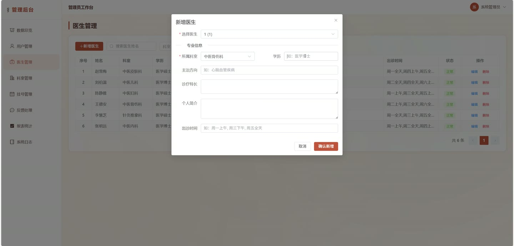
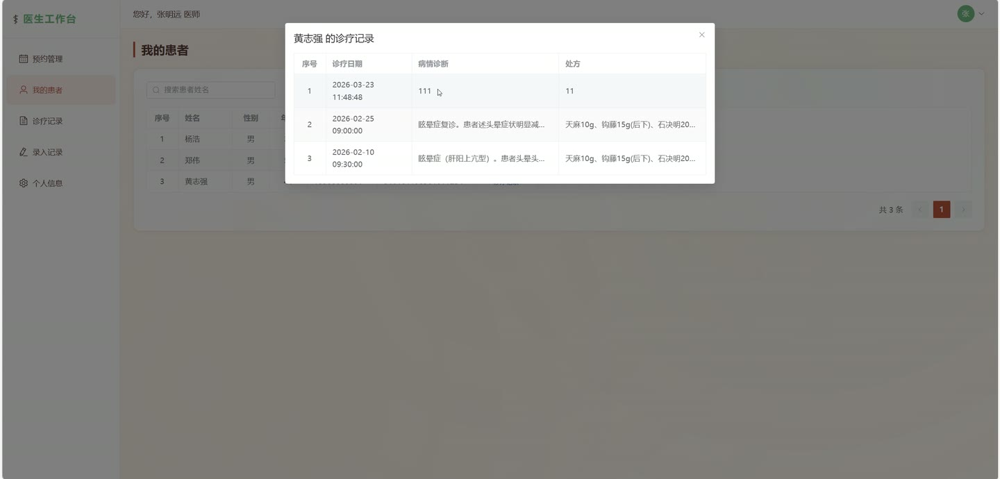

# (附文档)Springboot3+Vue3+MySQL 世家中医馆客服网络平台

**技术栈**：Springboot3、Vue3、MySQL

### 系统简介

世家中医馆客服网络平台是一套基于 Springboot3 + Vue3 前后端分离架构的中医馆业务管理系统。系统支持患者在线挂号预约、查看诊疗记录、提交反馈；医生端可管理预约、录入诊疗记录、查看名下患者；管理员端提供用户管理、医生信息管理、科室管理、预约管理、反馈回复、系统日志查看及多维度数据报表统计功能，覆盖中医馆日常运营的核心业务流程。
 
### 核心功能
 
### 普通用户端

 
- 用户注册：填写用户名、密码、真实姓名、手机号等信息完成注册，默认角色为患者。 
- 用户登录：输入用户名和密码进行登录，返回 JWT Token 用于后续接口鉴权。 
- 查看个人信息：获取当前登录用户的账号信息（用户名、真实姓名、手机号、角色、头像等）。 
- 修改个人信息：更新真实姓名、手机号、头像等个人资料。 
- 修改密码：输入旧密码和新密码完成密码修改。 
- 浏览科室列表：查看所有中医科室的名称和描述。 
- 浏览医生列表：按科室筛选或输入关键词（姓名/方向/特长）搜索医生，查看医生简介、所属科室、主治方向。 
- 查看医生详情：查看指定医生的详细信息，包括个人简介、所属科室、主治方向、职称等。 
- 创建挂号预约：选择医生、预约日期、时段（上午/下午），提交预约申请，系统自动校验是否重复预约同一医生同一时段。 
- 查看我的预约：分页查看自己的挂号记录，支持按状态（待就诊/已就诊/已取消）筛选。 
- 取消预约：对待就诊状态的预约进行取消操作。 
- 查看我的诊疗记录：分页查看自己的历史诊疗记录，支持按关键词搜索。 
- 查看诊疗记录详情：查看某条诊疗记录的详细内容，包括诊断结果、处方、医嘱等。 
- 提交反馈：填写反馈类型和内容，向平台提交意见或建议。 
- 查看我的反馈：分页查看自己提交的反馈记录及管理员的回复内容。
 
### 医生端

 
- 查看我的医生信息：获取当前登录医生账号关联的专业信息（所属科室、职称、简介、主治方向等）。 
- 查看我的预约列表：分页查看分配给自己的挂号预约记录，支持按状态筛选。 
- 查看名下患者列表：通过预约记录自动归集名下患者，支持按患者真实姓名模糊搜索。 
- 查看我的诊疗记录：分页查看自己录入的诊疗记录，支持按患者姓名筛选。 
- 录入诊疗记录：为某位患者填写诊断结果、处方、医嘱、记录日期等，完成诊疗记录录入。 
- 查看诊疗记录详情：查看某条诊疗记录的完整信息，包括患者信息、诊断内容。 
- 完成就诊：更新预约状态为“已就诊”。
 
### 管理员端

 
- 总览仪表盘：查看总患者数、总医生数、总挂号数、总诊疗数、今日挂号数、待就诊数等关键指标。 
- 用户管理：分页查询患者/医生用户列表，支持按真实姓名、角色、状态筛选。 
- 修改用户状态：对用户进行冻结（禁用）或解封操作。 
- 编辑用户信息：管理员直接更新指定用户的基本信息。 
- 科室管理：添加、编辑、删除中医科室（科室名称、描述）。 
- 医生信息管理：分页查询医生列表，支持按姓名、科室、主治方向筛选。 
- 新增医生：从已注册的医生用户中选择未录入专业信息的用户，填写所属科室、职称、简介、主治方向等完成录入。 
- 编辑医生信息：更新医生的所属科室、职称、简介、主治方向等专业信息。 
- 删除医生：同时删除医生专业信息和关联的用户账号。 
- 预约管理：分页查询所有预约记录，支持按患者姓名、医生姓名、状态筛选。 
- 取消预约：管理员可取消任意待就诊状态的预约。 
- 反馈管理：分页查询所有用户提交的反馈，支持按反馈类型、状态筛选。 
- 回复反馈：管理员对反馈进行回复，并更新反馈状态为“已处理”。 
- 系统日志：分页查看系统操作日志，支持按用户名、操作内容筛选。 
- 挂号趋势统计：查看近7天或近30天的每日挂号数量趋势图。 
- 科室接诊统计：按科室统计已就诊的预约数量。 
- 医生服务量统计：按医生统计已就诊的预约数量。 
- 月度统计：查看近6个月的挂号量和诊疗量月度数据。
 
### 技术栈

 后端框架Spring Boot 3.x ORM 框架MyBatis-Plus 权限认证Spring Security + JWT 前端框架Vue 3 状态管理Pinia 构建工具Vite 数据库MySQL 分页插件MyBatis-Plus Pagination
 
### 交付内容

 
- 后端完整源码 
- 前端完整源码 
- 数据库初始化脚本 
- 万字文档

## 界面展示

---

## 获取完整源码 + 万字文档

本仓库为项目介绍页。**完整前后端源码、数据库初始化脚本、万字项目文档**，请访问 [codekk.top](http://codekk.top) 获取。

可作课程设计 / 毕业设计参考，支持远程部署调试。